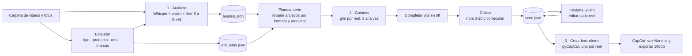

# 2 · Arquitectura técnica

*Actualizado: 4 oct 2026*

Reel Studio es Python puro: un **motor** (`reel_studio.py`), un **servidor local** (`studio_web.py`, solo 127.0.0.1) y una **interfaz web** (`studio.html`) mostrada en una ventana nativa de Windows con pywebview (WebView2 de Edge).

## Cómo fluye el material

## Archivos del repo

| Archivo | Para qué |
|---|---|
| `ReelStudio.pyw` | Ventana de escritorio (pywebview): diálogo de carpetas, confirma antes de cerrar si hay una tarea |
| `studio_web.py` | Servidor local: estado, tareas en segundo plano, `/media` (reproductor con Range y copias HEVC→H.264), miniaturas, etiquetas, catálogo |
| `studio.html` | Interfaz: 3 pasos, pestañas Etiquetar · Tomas · Guion · Registro, reproductor con marcas |
| `reel_studio.py` | Motor: analizar, etiquetas, planear serie, guiones, voz en off, crítico, PNG de marca, armar en CapCut |
| `gen_music.py` | Música propia sintetizada (numpy, 128 BPM, sin derechos) |
| `productos.json` | 20 productos con precio, descripción, «ideal para» y badge, sacados de la landing |
| `Crear_exe.bat` | Empaqueta con PyInstaller → `dist\ReelStudio\ReelStudio.exe` |
| `requirements.txt` | faster-whisper, pillow, pillow-heif, numpy, pywebview, pymediainfo, imageio |
| `reel_capcut.py` | Versión vieja por línea de comandos |
| `readme-motion/` | Proyecto HyperFrames del video del README |
| `docs/contexto/` | Estos documentos |

`pyCapCut` no está en el repo: se clona aparte en `..\pyCapCut` (`pip install -e ..\pyCapCut`).

## Modelos y herramientas

| Pieza | Qué usa | Para qué |
|---|---|---|
| Visión | `glm-5.3-flash:cloud` o `gemma3:4b` (Ollama) | Describe un fotograma cada 3 s (con la pista del producto y las marcas) |
| Jev | `nimble:latest` vía `/v1/systemone` | Decide usable (sí/no), tipo de toma y cuánto engancha |
| Transcripción | faster-whisper `small` (CPU) | Lo que se dice, para no cortar frases |
| Guion y crítico | `glm-5.3-flash:cloud` (o cualquier modelo de texto) | Escribe cada reel y luego lo revisa como editor |
| CapCut | pyCapCut | Escribe borradores que CapCut abre como propios |
| Medios | ffmpeg / ffprobe | Fotogramas, miniaturas, duración, rotación, copias para el reproductor |

## Datos que se generan en la carpeta de videos

| Archivo | Qué guarda |
|---|---|
| `analisis.json` | Por archivo: duración, lo que se dice (Whisper) y cada toma de 3 s con descripción, tipo, usable, interés y si es «repetida» |
| `etiquetas.json` | Lo que puso el dueño: tipo fijo, producto, nota y marcas `{t, texto}` por archivo |
| `serie.json` | Los reels: formato, título, producto, nombre del borrador, gancho, promesa, clips (con «audio original»), narración y la revisión del crítico |
| `_reel_studio/` | PNG de marca y música por reel, miniaturas y copias de previsualización |
| `_jpg/` | Fotos HEIC convertidas a JPG |

Las etiquetas se aplican **al usar** el análisis (`aplicar_etiquetas`), así que una etiqueta nueva vale sin volver a analizar.

## Formatos de la serie

| Formato | Estructura | Tomas núcleo | Por producto |
|---|---|---|---|
| Unboxing | gancho → sellado → lo abrimos → qué trae → de cerca → precio → CTA | unboxing | Sí |
| Review | gancho → qué es → lo conectamos → cómo suena → detalles → ¿vale la pena? → CTA | prueba de sonido | Sí |
| Educativo | gancho → dato 1 → dato 2 → dato 3 → para quién es → precio → CTA | producto, prueba, unboxing (puede reusar tomas) | Sí |
| Entregas | gancho → sale el pedido → en camino → llegamos → lo prueba → paga después → CTA | entrega en moto, pago | No |
| Así compras | gancho → 5 pasos de compra → CTA | entrega, prueba, pago | No |

**Reparto (`planear_serie`):** cada archivo cuenta como el tipo que más pesa en sus tomas buenas (o el que le puso el dueño) y va a un solo reel, salvo el Educativo, que puede reusar. Un reel necesita al menos **35 s** de tomas buenas; si no, se avisa y no se arma.

## El crítico y la voz en off

**Voz en off (`completar_voz`):**
- Meta: ~2,4 palabras por segundo en cada clip sin «audio original» (lo que lee Nandez).
- Sigue el tiempo real de la voz: si una frase se alarga, el siguiente clip recibe menos; nunca se pasa del final.
- Rellena con frases por paso y con **datos reales del producto** (`productos.json`); el primer clip abre con el gancho dicho.
- Con modelo de texto, solo rellena los huecos que dejó el modelo.

**Crítico (`revisar`):**
1. **Chequeos medibles:** duración (< 20 s descarta, < 25 s grave, > 50 s largo), planos quietos > 5 s, tramos repetidos, producto en pantalla < 10 s, > 40 % fotos, pasos desordenados, cobertura de voz < 70 %, gancho sin voz o de más de 7 palabras.
2. **Editor exigente (modelo de texto):** recibe el guion clip por clip (qué se ve, qué se dice, qué narra la voz), pone nota 0-10, veredicto (publicar / mejorar / descartar) y, si se puede mejorar con el mismo material, devuelve el guion corregido. La corrección solo se aplica si no empeora lo medible.

**Respaldo del modelo (`escribir_guion`):** pide en streaming y prueba de lo más estricto a lo más simple: esquema JSON sin razonamiento → esquema → `json` → texto libre. Corta si pasa de 15 000 caracteres o de 10 minutos.

## Armado en CapCut (`armar_sel`)

- Pistas: video, textos (gancho y chips), cta, voz (textos para Texto a voz) y música.
- Encuadre: las tomas 4:3 se amplían para llenar el 9:16; si haría falta ampliar más de 1,6× (horizontal), se usa fondo desenfocado. Respeta la rotación del teléfono.
- Volumen: con voz en off, los clips sin «audio original» van en silencio (queda música + voz).
- PNG de marca y música por reel en `_reel_studio/<nombre>/`.
